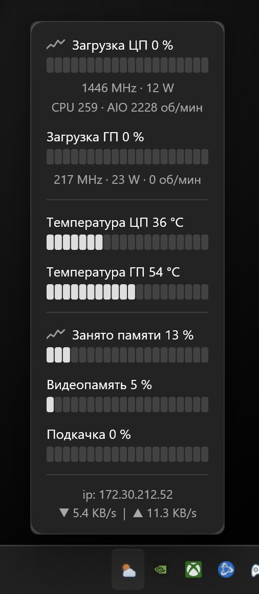
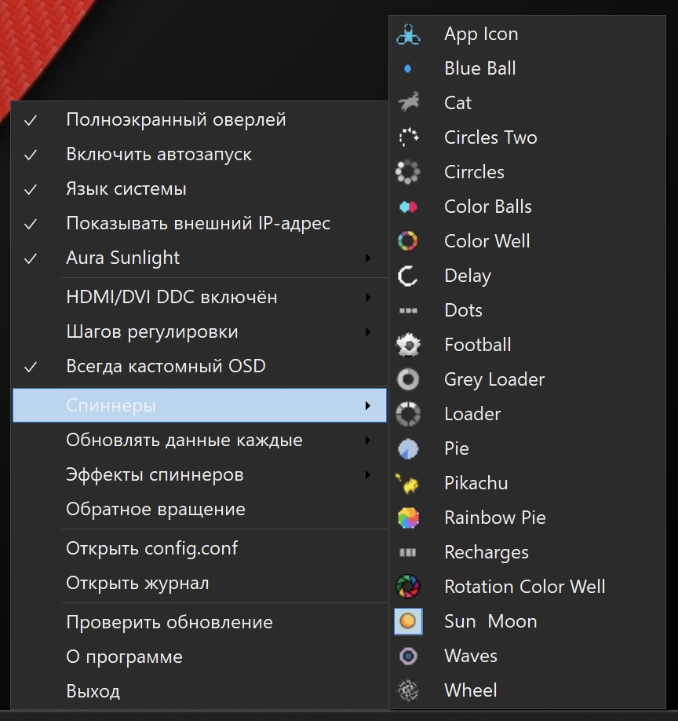
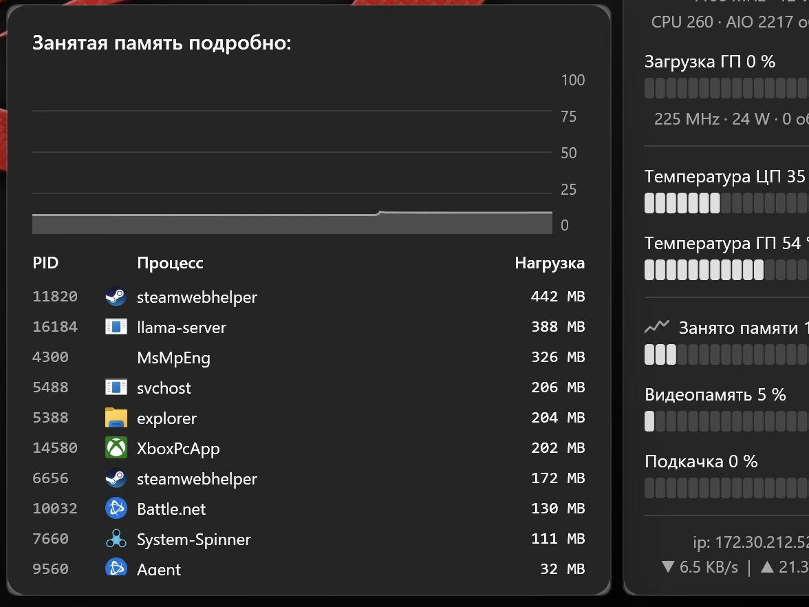

# System Spinner x64 (for Windows)

System monitoring with two faces: a tray icon outside and/or panel inside game.

This is Windows version, if you looking for MacOS go to [System Spinner](https://github.com/andrey-lysikov/System-Spinner)

While a full-screen application is in front of you, this is an overlay. The moment it is gone, this is a tray icon.

## Features

- Show CPU usage in menu bar
- Audio and brightness external monitor control (over HDMI/DVI/USB-C with standard keys)
- Custom OSD for Windows for volume and brightness control
- Custom choice for adjustments (more accurate volume and brightness control)
- Top CPU/MEM process in popup window
- Memory statistics with swap
- Network utilisation and external ip address (use checkip.dyndns.org, you can turn off showing external ip)
- Hardware Information for Cpu Temp and Fan
- Native Windows application with system appearance support 
- Spinner overlay effects
- In fullscreen mode with a customisable game overlay
- Localization (English, Arabic, Chinese, French, German, Italian, Japanese, Russian)

## Screenshots

  
  
  

## Tech

Written on C#, Windows 11 and newer, .NET Desktop Runtime 10 or newer, **PawnIO** — [pawnio.eu](https://pawnio.eu)
